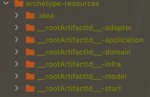
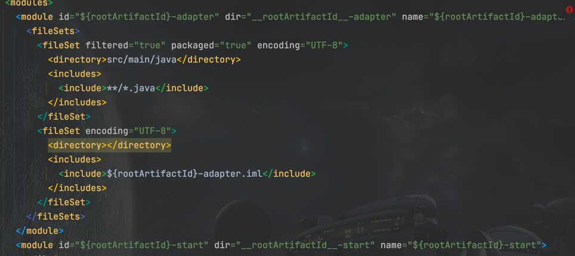
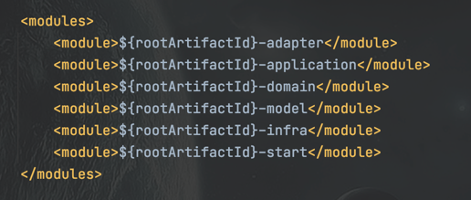
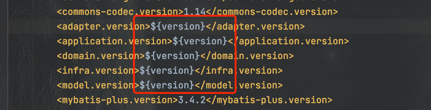
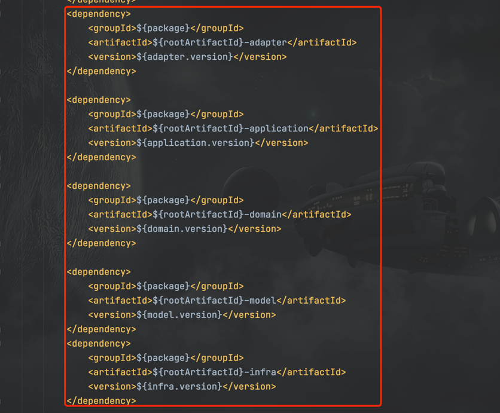
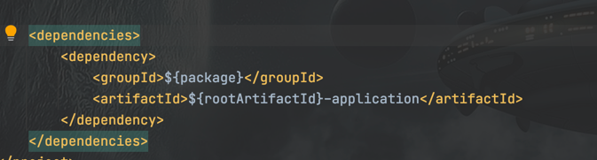

# maven-多模块脚手架制作

## build
> mvn archetype:create-from-project

## 文件修改
target/generated-sources/archetype/src/main/resources/archetype-resources

下目录文件修改 前加__rootArtifactId__

target/generated-sources/archetype/src/main/resources/META-INF/maven   
修改每个model的id,dir,name和.impl

target/generated-sources/archetype/src/main/resources/archetype-resources/pom.xml  
添加module  

设置各module的版本

对各module的依赖进行修改

target/generated-sources/archetype/src/main/resources/archetype-resources/__rootArtifactId__-start/src/main/java/start
目录保持一致,若有出入进行相应调整

对各module中pom.xml中对其他模块的依赖进行调整
target/generated-sources/archetype/src/main/resources/archetype-resources/__rootArtifactId__-application/pom.xml

各模块中对import引入进行调整 可按Directory全部替换
eg:${package}.${artifactId} ->> ${package}.domain ; 每个模块都要检查替换一次

## 发布
进入目录 target/generated-sources/archetype 执行命令
> mvn install or mvn deploy

# 使用脚手架
eg.创建一个fan-backend的项目
~~~
mvn -U archetype:generate \
-DarchetypeGroupId=com.steven.maven.archetype \
-DarchetypeArtifactId=steven-maven-archetype-archetype \
-DarchetypeVersion=0.0.1-SNAPSHOT \
-Dversion=1.0.0-SNAPSHOT \
-DgroupId=com.fan.backend \
-DartifactId=fan-backend \
-DappName=fan-backend 
~~~

